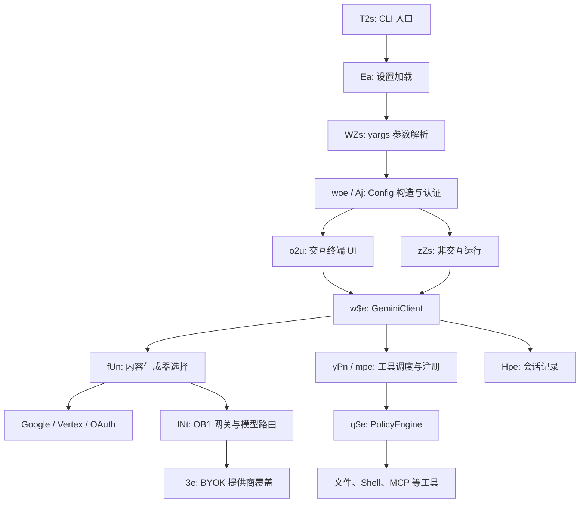

# 架构与维护入口

本文对应初始恢复的 `src/ob1.cjs`。行号会随着后续修改改变，可运行 `npm run analyze` 和 `npm run lookup -- <名称>` 重新定位。

## 程序形态

原程序是 x86_64 Mach-O，Node SEA 段内保存 CommonJS JavaScript 明文，而非只能反编译的 V8 快照。应用和依赖被打成一个文件；`B` 是一次性 ESM 初始化包装器，`x` 是 CommonJS 包装器，`du` 保存导出名称映射。恢复出的 3,777 个包装器不等于原仓库的源文件数量。

代码保留 `bundle/gemini-sea.cjs` 入口路径、Gemini CLI 类型/接口名称、Google 版权说明；据此可以判断有 Gemini CLI 衍生结构。尚未把整个发行包精确对应到某一上游提交；`5280ab7` 和 `99e523a15` 都只是包内发现的构建线索。

## 启动与请求流程

这是从客户端静态调用关系整理的概览，不是服务端架构图。

| 修改目标 | 符号 / 初始行号 | 说明 |
| --- | --- | --- |
| 程序启动 | `T2s`，613964 | 设置、参数、认证、恢复会话、交互/非交互分流 |
| 命令行选项 | `WZs`，610280 | model、prompt、incognito、policy、resume、ACP、输出格式 |
| 应用配置 | `Aj` / `Config`，515517；`woe` 在参数解析后 | 配置和各服务生命周期 |
| 生成器选择 | `fUn` / `createContentGenerator`，405700 | 模拟响应、Google、OB1、Ollama 等分支 |
| OB1 网关 | `INt`，204297 | API 基址、客户端构造、请求/模型路由 |
| BYOK | `Tk`、`_3e`、`Nce`，168736–168911 附近 | 读取 byok.json，选择提供商、密钥和 base URL |
| 云端 API 基址 | `Rc` / `getApiHost`，160268 | 默认 dashboard.openblocklabs.com |
| 访问令牌 | `b0`、`Vu`，118130、118156 | 环境变量优先，之后读取/刷新 OAuth |
| 核心模型会话 | `w$e` / `GeminiClient`，494034 | 对话、模型调用、工具回合 |
| 工具调度 | `yPn` / `CoreToolScheduler`，423022 | 工具生命周期、确认、结果处理 |
| 工具注册表 | `mpe` / `ToolRegistry`，406001 | 内置工具与发现机制 |
| 文件读取 | `$Ce` / `ReadFileTool`，426448 | 参数为 file_path、offset、limit |
| 文件编辑/写入 | `xFe` / `EditTool`，485740；`kFe` / `WriteFileTool`，486645 | 文件修改与校验 |
| Shell 执行 | `SCe` / `ShellTool`，422090 | command、dir_path、后台任务；使用 Bash 解析器 |
| 权限策略 | `q$e` / `PolicyEngine`，500730 | 优先级规则、批准决策 |
| MCP 客户端 | `Cet` / `McpClient`，514906 | MCP 服务器连接和工具 |
| 系统提示词 | `t_`，425456 | 动态组合上下文，支持 GEMINI_SYSTEM_MD |
| 会话存储 | `Hpe` / `ChatRecordingService`，423707 | 工具调用、会话 JSON、可选分享 |
| 存储路径 | `co` / `Storage`，86516；`Di`，84952 | .ob1 下路径与 GEMINI_CLI_HOME |
| 非交互主循环 | `zZs`，611596 | stdin、流式响应、工具事件、输出格式 |
| 错误遥测开关 | `rce`，162101 附近 | SENTRY_ENABLED=false |
| 自更新 | 243200 附近、590760 附近 | 仍使用厂商安装脚本 URL |

符号表中的 class 行号有时指向前面的变量声明，实际类定义在紧随其后的初始化器内。`reports/classes.json` 提供类体和方法的准确位置。

## 本地状态与资源

常见状态路径包含 `.ob1/settings.json`、`.ob1/credentials.json`、`.ob1/byok.json`、`.ob1/model-config.json`、`.ob1/tmp/<project>/chats/*.json`、历史/统计文件。此恢复过程没有读取或复制你的凭据和会话内容；回归报告中的会话来自新建的测试用户目录。

部分代码使用 `GEMINI_CLI_HOME`，部分直接使用 `os.homedir()`，所以开发启动器同时为子进程设置这两个位置。仅设置 GEMINI_CLI_HOME 不足以隔离所有账户和历史路径。

默认策略从当前代码/可执行文件旁的 `policies/` 加载；macOS 沙箱同样查找相邻 `.sb` 文件。构建脚本同时为 `dist/bin/` 与 `dist/bundle/` 准备它们。Shell 使用的两个 WASM 已嵌入 JS，提取副本用于分析，不依赖外部下载。

优化脚本的 `qO()`（207310 附近）先查找用户目录 `.ob1/scripts/optimize/`；SEA 模式缺失此目录会报错，普通脚本模式才回退到代码旁的 `../scripts/optimize/`。开发启动器自动在自己的状态目录准备这些脚本。

## 脱离厂商服务的接入位置

BYOK 配置格式可参考 `examples/byok.json`。在开发实例中放到 `.work/dev-home/.ob1/byok.json`；其中 `preferDirect: true` 开启直接提供商路由。代码支持以下映射：

| 提供商 | API 密钥变量 | 自定义地址变量 |
| --- | --- | --- |
| anthropic | `OB1_ANTHROPIC_API_KEY` | `OB1_ANTHROPIC_BASE_URL` |
| openai | `OB1_OPENAI_API_KEY` | `OB1_OPENAI_BASE_URL` |
| google | `OB1_GOOGLE_API_KEY` | `OB1_GOOGLE_BASE_URL` |
| openrouter | `OB1_OPENROUTER_API_KEY` | `OB1_OPENROUTER_BASE_URL` |

提供商由模型 ID 的前缀选择，再尝试 OpenRouter。base URL 校验允许 HTTPS，以及本机地址的 HTTP。以上均是本地发行包代码行为，尚未用真实密钥验证所有模型/协议组合。

普通 `GEMINI_API_KEY` 另有 Google 认证/生成器路径，不能与 `OB1_GOOGLE_API_KEY` 的 BYOK 路径混为一谈。测试使用伪 GEMINI_API_KEY 加应用自己的 `--fake-responses`，并在操作系统层禁止网络访问。

`OPENROUTER_API_HOST` 覆盖 `Rc()` 返回的整站 API host，`OPENROUTER_API_URL` 可覆盖模型网关 base URL；它们名字带 OpenRouter，但默认指向 OB1 的厂商服务。`PARALLEL_API_HOST`、`OB1_SHARE_API_URL`、`OB1_SHARE_BASE_URL`、`OB1_CLOUD_AGENTS_URL` 是其他独立路径。只更换一个 host 不会自动替换所有云功能。

客户端可观察到的服务契约包括：

| 路径 / 功能 | 客户端维护影响 |
| --- | --- |
| `/api/v1` 模型网关 | 可评估复用 BYOK 分支或适配兼容后端 |
| `/api/v1/credits` | 厂商额度查询，与实际第三方模型认证分离 |
| `/api/v1/ob1/sync`、`sync/pull`、`settings` | 远程会话和配置同步 |
| `/api/v1/chats/...` | 分享、下载与 clone |
| `/api/v1/parallel/...` | 网页提取、搜索和研究代理 |
| `/api/v1/agent-tasks/...` | 云任务及 teleport |
| 安装/升级 URL | 维护分支发布时需要替换原厂更新来源 |

这些调用点可以辅助实现兼容接口；数据库、后台任务和服务端业务逻辑没有随客户端发行。维护方向宜先验证目标提供商的 BYOK 完整回合，再按需要替换云同步、搜索和更新服务。
